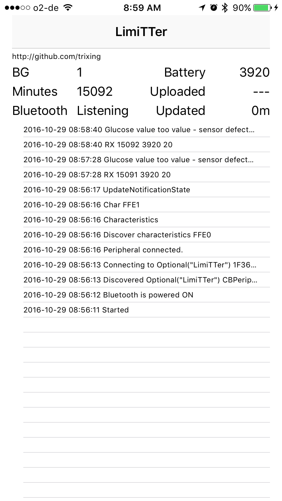
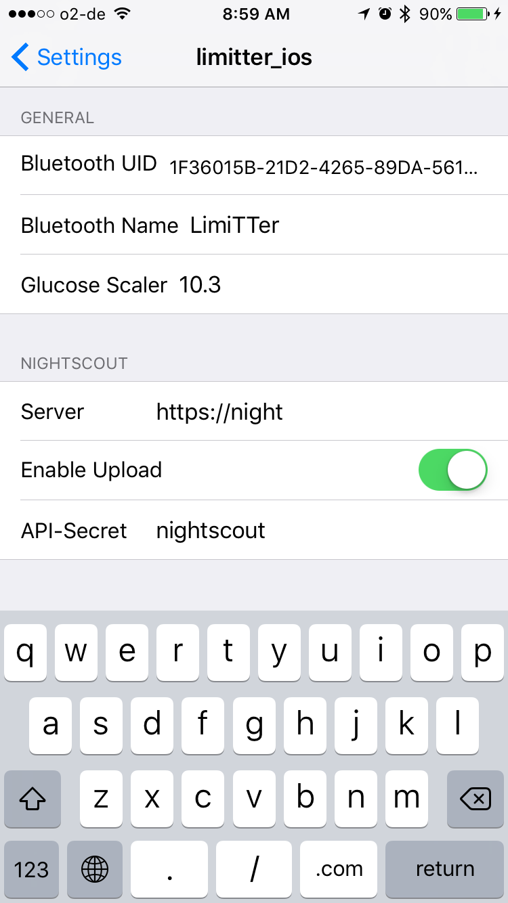

# LimiTTer_iOS

iOS App for the LimiTTer device for Freestyle Libre

This app reads data from a modified [LimiTTer](https://github.com/trixing/LimiTTer)
variant and stores it into Apple
Healthkit for other Apps to use (for example to build a closed
[Loop](https://github.com/LoopKit/Loop)).  It also uploads the data to Nightscout.

Please note that this project only works with the modified version of
LimiTTer which outputs a slightly different data format and higher frequency
samples (roughly one per minute).  Calibration is done within the iOS app source
code, not on the sensor.

# Screenshots

## Main page

## Settings

